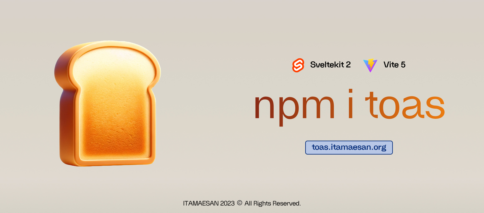
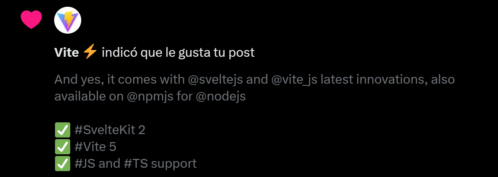

> [!NOTE]  
> This is in pre-beta



Thanks for your support Vite

Source: [https://x.com/MiguelGargallo/status/1736023947810885761?s=20](https://x.com/MiguelGargallo/status/1736023947810885761?s=20)

- [Usage](#usage)
- [Initial config](#initial-config)
	- [In this version](#in-this-version)
	- [How to use it](#how-to-use-it)
- [About the License](#about-the-license)

## Usage

Look, you add the export function you can look at the directory for a [Real case](./realcase/Component.svelte.md)

```svelte
<!-- Component.svelte -->

<script>
	import Toas from '$lib/Toas.svelte';

	export function handleSuccess() {
		// @ts-ignore
		window['showToas']('Operation Successful', 'success');
	}
	
	export function handleError() {
		// @ts-ignore
		window['showToas']('Operation Error', 'error');
	}

	export function handleLoading() {
		// @ts-ignore
		window['showToas']('Operation Loading', 'loading');
	}
	
	// This is an example
	const yourFunction = ... {
		... Your Code ... 
		handleLoading(); // Just invoke the function
		... Your Code ... 
			{
				... Your Code ... 
			handleSuccess(); // Just invoke the function
				... Your Code ... 
			} catch (err) {
				... Your Code ...
			handleError(); // Just invoke the function
				... Your Code ... 
		}
	};

	yourFunction();
</script>

<Toas />

your html goes here here
```

## Initial config
Toas is a web component that will allow you to add notifications without the need of an external library.

### In this version
We added colors to the notifications, and we are currently working on icons.

### How to use it
Just copy and paste the code from [here](./src/lib/Toas.svelte) and use it like this file [here](./src/routes/+page.svelte).

## About the License
This project is under the [Pylar AI Creative ML Free License](./License.md).